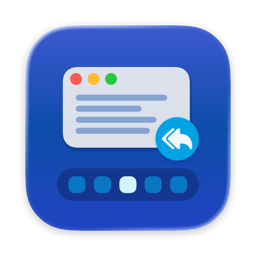
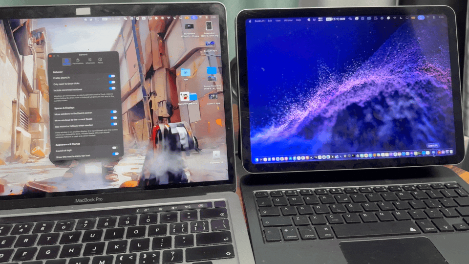
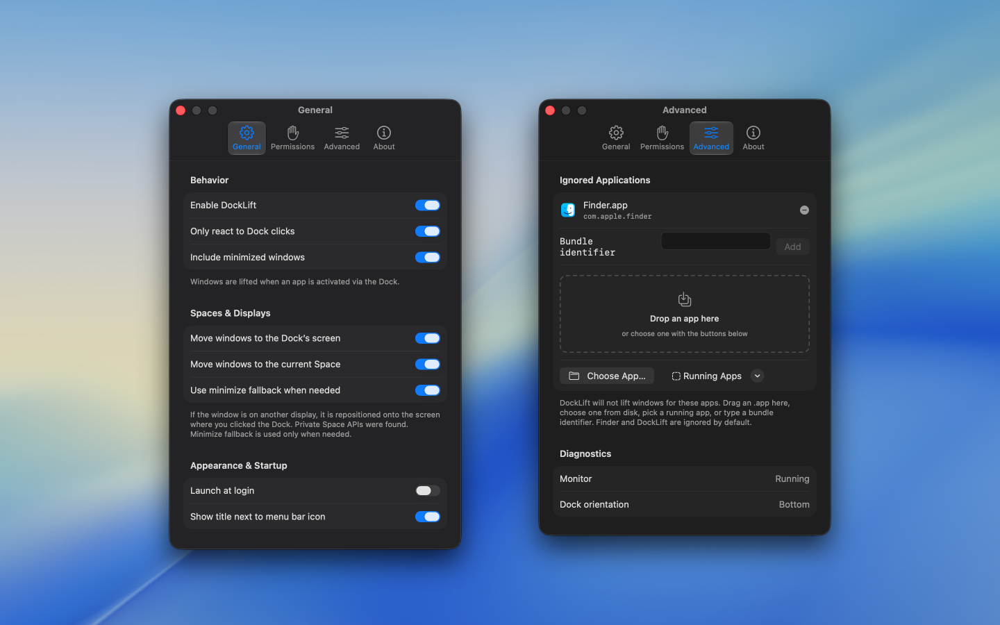

<div align="center">
  <br />
  <br />
  
  <h1>
    DockLift
  </h1>
  <!--rehype:style=border: 0;-->
  <p>
    <a href="./README.zh.md">简体中文</a> • 
    <a target="_blank" href="https://github.com/jaywcjlove/docklift/issues/new?template=bug_report.yml">Contact & Support</a> • 
    <a href="./docs/CHANGELOG.md">Changelog</a> • 
    <a target="_blank" href="https://x.com/jaywcjlove">𝕏</a>
  </p>
  <p>
    <a target="_blank" href="https://github.com/jaywcjlove/dock-lift/releases/latest/" title="DockLift for macOS">
      
    </a>
  </p>
</div>

```shell
# Installation (automatically installs to /Applications)
$ brew install --cask jaywcjlove/tap/dock-lift
```





Using a Mac with more than one display, you may click an app in the Dock only to find its window still on the other screen—open, but not in front of you.

**DockLift** lives in the menu bar and, when you click a Dock icon, moves that app’s recent window to **the screen you’re on** and brings it to the front.

### Features

- Bring windows to the screen where you clicked the Dock
- Hold Shift while clicking a Dock icon to move that app’s windows from other displays to the current screen
- Works when the app is already open on another display
- Restores minimized windows
- Simple menu bar on/off control
- Ignore apps you don’t want

### How to use

1. Open DockLift — it appears in the menu bar.
2. Allow Accessibility when macOS asks (needed to move windows).
3. Keep DockLift enabled.
4. Click an app in the Dock — if its window is on another screen, it should appear on the screen you’re using.
5. Hold Shift while clicking a Dock icon to bring that app’s windows from other displays onto the current screen.

<!--version: v1.0.0-->
